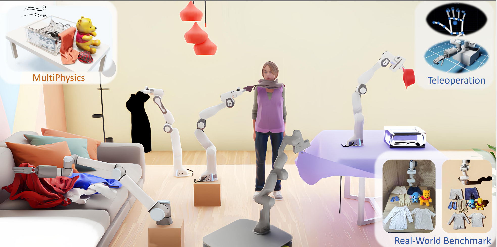
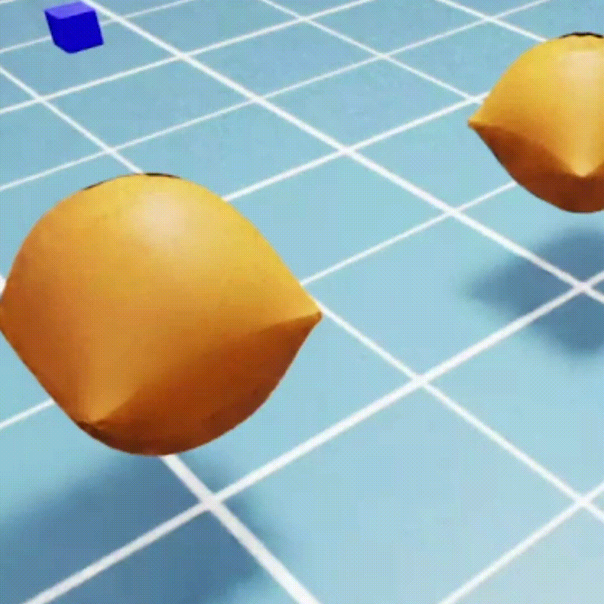

<h2 align="center">
  <b><tt>Garmentlab</tt>: A Unified Simulation and Benchmark for Garment Manipulation</b>
</h2>

<div align="center" margin-bottom="6em">
<b>NeurIPS 2024</b>
</div>


<div align="center" margin-bottom="6em">

</div>
&nbsp;

<div align="center">
    <a href="https://arxiv.org/abs/2411.01200" target="_blank">
    </a>
    <a href="https://garmentlab.github.io/" target="_blank">
    </a>
    <a href="https://garmentlab.readthedocs.io/en/latest/" target="_blank">
    </a>
    <a href="https://garmentlab.github.io/static/videos/ID_7401.mp4" target="_blank">
    </a>
    <a href="https://github.com/GarmentLab/GarmentLab" target="_blank">
    </a>
    <a href="https://drive.google.com/drive/folders/1CqJILIK8VQ-RCuLa_aFN-WtYTbovpFga?usp=sharing" target="_blank">
    </a>
    <a href="https://garmentlab.readthedocs.io/en/latest/tutorial/realworldbenchmark/index.html" target="_blank">
    </a>
</div>
&nbsp;



We introduce **GarmentLab**, a unified simulation and benchmark designed to address the complexities of garment manipulation. Here are the key features and contributions of GarmentLab:

- **Realistic Simulation**: Built on **NVIDIA’s Isaac Sim**, GarmentLab offers a highly-paralleled data collection pipeline and realistic rendering, supporting various sensors and robot operating systems (ROS). The simulation methods include Particle-Based Dynamics (PBD) and Finite Element Method (FEM) for diverse garment types, allowing for precise simulation of garment dynamics.

- **Diverse Task Coverage**: GarmentLab supports a wide range of tasks involving interactions between garments, deformable objects, rigid bodies, fluids, and human bodies. It covers 11 categories of garments and includes various robotic manipulators, providing 20 tasks across 5 groups, including garment-garment and garment-avatar interactions.

- **Extensive Dataset and Assets**: The benchmark includes a large-scale dataset of garments, robot models, and 3D assets. It features 20 scenes and over 9000 object models from diverse dataset (ClothesNet, Cloth3D, ShapeNet, PartNet-Mobility, etc), ensuring rich simulation content and diverse task scenarios.

- **Sim-to-Real Gap Bridging**: To address the sim-to-real challenge, GarmentLab integrates methods like Teleoperation and Visual Sim-Real Alignment. These techniques enhance the real-world applicability of trained models by aligning simulation with real-world data.

- **Open Source and Community Contribution**: GarmentLab aims to be an open-source project, providing comprehensive analysis and evaluation tools for future research. It supports the development of robust algorithms for garment manipulation by offering a realistic simulation environment and a rich set of assets.

This benchmark serves as a robust platform for advancing the field of robotic garment manipulation, providing researchers with the tools to explore and develop new methods for this challenging domain.

We provide brief guidance on this page. Please refer to [our documentation](https://garmentlab.readthedocs.io/en/latest/) for more information about <tt>garmentlab</tt>.

|Image|Name|Description|
|----------|:-------------|:-------------|
|  |[Hang](demo/HangDemo.py) | Hang the clothes on the clothesline |
|  |[Fling](demo/FlingDemo.py) | Unfold the clothes and lay them flat on the floor|
|  |[Wash](demo/WashDemo.py)| Put the scarf into the sink and wash it clean|
|  |[Store](demo/StoreDemo.py)| Grab the hat and put it in the closet |
|  |[Fold](demo/FoldDemo.py)| Fold the flat-laid piece of clothing neatly|
|  |[PhysicsGarment](physxDemo/cloth.py)| test the performance of garment simulation|
|  |[PhysicsDerformable](physxDemo/pillow.py)| test the performance of Deformable simulation|
| |[PhysicsHat](physxDemo/hat.py)| test the performance of Hat simulation| 
|  |[Mobile](Env/env/MakeTableEnv.py)| Flatten the tablecloth by a mobile Franka| 

# Get Started
## 1. Install Isaac Sim-4.0.0
Note that our code is based on Isaac Sim-4.0.0, so you need to install Isaac Sim-4.0.0 first.

To install Isaac Sim, please follow the instructions provided in [this tutorial](https://developer.nvidia.com/isaac-sim)
## 2. Clone the Code Repository

Clone the GarmentLab code repository from GitHub. Open your terminal and run the following command:

```bash
git clone https://github.com/GarmentLab/GarmentLab.git
```

This will download the code to your local machine. Navigate to the project directory:

```bash
cd GarmentLab
```

## 3. Download and Set Up Assets

Download the required assets from [this Google Drive link](https://drive.google.com/drive/folders/1CqJILIK8VQ-RCuLa_aFN-WtYTbovpFga?usp=sharing). After downloading, extract the contents into the `Assets` folder within your project directory. Ensure that the folder structure is correct and that all files are properly placed.


## 4. Install Dependencies
After install the isaacsim and clone our code, you can locate the [python executable](https://docs.omniverse.nvidia.com/isaacsim/latest/installation/install_python.html) in Isaac Sim. By default, this should be python.sh. We will refer to this path as PYTHON_PATH.

To set a PYTHON_PATH variable in the terminal that links to the python executable, we can run a command that resembles the following. Make sure to update the paths to your local path.
    
```bash
For Linux: alias PYTHON_PATH=~/.local/share/ov/pkg/isaac_sim-*/python.sh
For Windows: doskey PYTHON_PATH=C:\Users\user\AppData\Local\ov\pkg\isaac_sim-*\python.bat $*
For IsaacSim Docker: alias PYTHON_PATH=/isaac-sim/python.sh
```

Then you can install the required dependencies by running the following command:

```bash
PYTHON_PATH -m pip install open3d
```

## 5. Verify Installation
To verify that the installation was successful, we will run some sample code of isaacsim, you can run the following command:
```bash
PYTHON_PATH ~/.local/share/ov/pkg/isaac_sim-4.0.0/standalone_examples/api/omni.isaac.core/add_cubes.py
```
If the code runs successfully, you can see we add some cubes in the scene. If you encounter any issues, please refer to the [Isaac Sim documentation](https://docs.omniverse.nvidia.com/isaacsim/latest/).

## 6. Run the Demos
After setting up the environment, you can run the demos in the `demo` folder. For example, to run the `Hang` demo, you can run the following command:

Remember to replace path to your assets folder in the demo code.
```bash
PYTHON_PATH demo/HangDemo.py
```
You can find more details to setup [here](https://garmentlab.readthedocs.io/en/latest/tutorial/setup/index.html)

## BibTex
```bibtex
@inproceedings{lu2024garmentlab,
  title={Garmentlab: A Unified Simulation and Benchmark for Garment Manipulation},
  booktitle={Advances in Neural Information Processing Systems},
  author={Lu, Haoran and Wu, Ruihai and Li, Yitong and Li, Sijie and Zhu, Ziyu and Ning, Chuanruo and Shen, Yan and Luo, Longzan and Chen, Yuanpei and Dong, Hao},
  year={2024}
}
```
